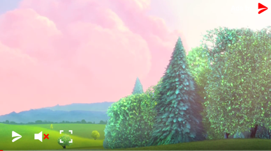

# Player Controls Visibility

`Available since 2.3.0`

Visibility of some buttons displayed by the player can be changed if required.

Here is player displaying all buttons:




## Changing Visibility

Each button can be hidden or shown:

```kotlin
val controller: AdPlayerController
controller.showPlayButton.value = false
controller.showSoundButton.value = false
controller.showFullscreenButton.value = false
```


## Visibility Default Values

Visibility states are represented as a nullable `Boolean?` type.
This allows seamless rollback to default value by passing a `null` value.

```kotlin
val controller: AdPlayerController
controller.showPlayButton.value = true        // visible 
controller.showSoundButton.value = false      // invisible
controller.showFullscreenButton.value = null  // default value
```
