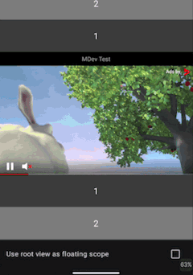
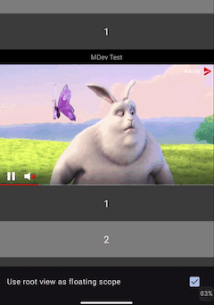

# Floating Placement

`Available since 4.0.0`

When the placement goes out of the view it is preferable to show it as a floating overlay.
This behavior can be enabled in the Aniview Dashboard:



`AdPlayerView` will search for any parent view that supports scrolling (like ScrollView or RecyclerView)
and track when it is no longer visible.
After that it will appear as a floating overlay above said container.


## Controlling Floating Scope

There are situations when automatic detection of the scrollable container doesn't fit requirements.
In such cases scrollable container can be provided manually:

```kotlin
val view: AdPlayerView
val container: View
view.floatingScope = container
```

After this floating placement will be displayed above provided container.

Here is example showing how it will look like when root view is chosen as a floating scope:


