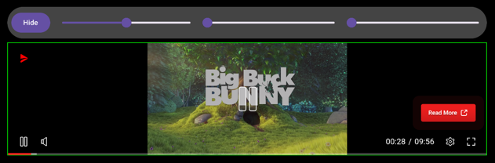
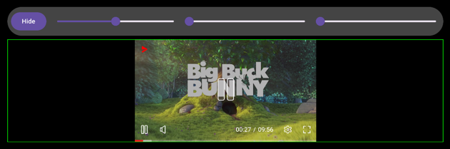
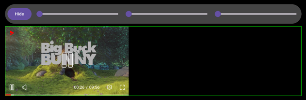
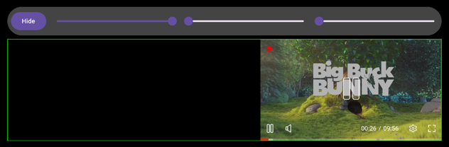
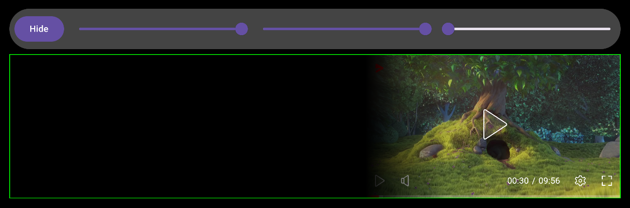
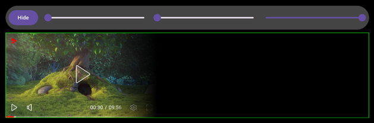

# Loose Constraints and Feathering

`Available since 2.1.0`

By default placement and tag video content have the same sizes.
Tag video content will be stretched to fill all available space in the placement (green border indicates placement size).



Sometimes it is required for video content to maintain its aspect ratio (usually 16/9).
This can be achieved by using loose constraints:

```kotlin
val view: AdPlayerView
view.looseConstraints = true
```



## Content Alignment

By default all content will be centered inside of the placement.
This can be changed by modifying alignment flag:

```kotlin
val view: AdPlayerView
view.looseConstraints = true
view.alignment = 0f // will align content to the start of the placement
```



```kotlin
val view: AdPlayerView
view.looseConstraints = true
view.alignment = 1f // will align content to the end of the placement
```



## Content Feathering

In addition to alignment it is also possible to add feathering to the content.
This will apply alpha gradient to specified side of the content.

```kotlin
val view: AdPlayerView
view.looseConstraints = true
view.alignment = 1f
view.featheringLeading = 128f
```



```kotlin
val view: AdPlayerView
view.looseConstraints = true
view.alignment = 0f
view.featheringTrailing = 128f
```

